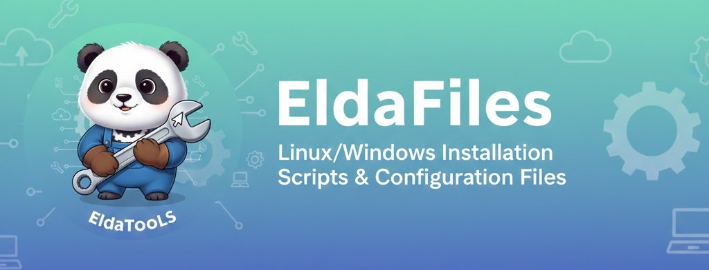

<p align="center">
  
</p>

# Eldafiles

Dépôt centralisant mes fichiers de configuration et scripts d'installation pour Windows et Linux.

## Structure du projet

```
eldafiles/
├── windows/          # Scripts et configurations Windows
│   ├── install/      # Scripts d'installation et setup
│   ├── config/       # Fichiers de configuration
│   └── hyperv/       # Scripts de virtualisation Hyper-V
├── linux/            # Scripts et configurations Linux
│   ├── install/      # Scripts d'installation et setup
│   └── config/       # Fichiers de configuration
└── shared/           # Fichiers partagés entre OS
```

## Contenu

### Windows
- Scripts PowerShell pour l'installation automatique de logiciels
- Fichiers de configuration d'applications Windows
- Scripts de setup d'environnement de développement
- **Scripts Hyper-V** : Déploiement automatique de VMs Linux avec accélération GPU 3D (GPU-PV)

### Linux
- Scripts Bash pour l'installation de paquets
- Dotfiles et configurations système
- Scripts de setup d'environnement de développement

### Partagé
- Configurations d'applications cross-platform
- Listes de logiciels recommandés
- Documentation commune

## Utilisation

### Windows
```powershell
# Exécuter un script d'installation
.\windows\install\setup-dev-environment.ps1

# Déployer une VM Linux avec Hyper-V et GPU-PV
.\windows\hyperv\quick-deploy.bat
```

### Linux
```bash
# Exécuter un script d'installation
chmod +x linux/install/setup-dev-environment.sh
./linux/install/setup-dev-environment.sh
```

## Contribuer

Ce dépôt est personnel mais les suggestions sont bienvenues via issues ou pull requests.
